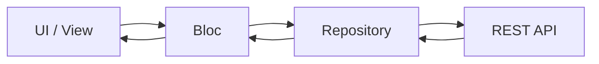
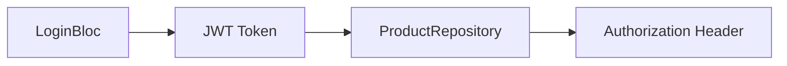
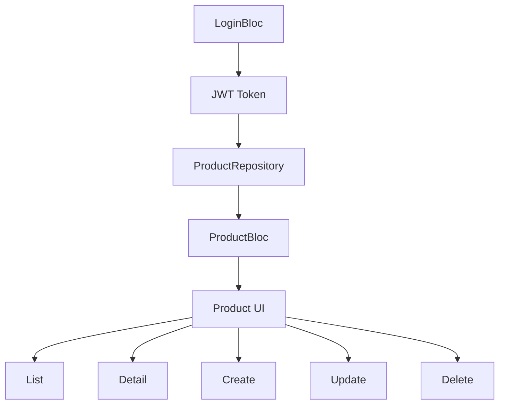

Berikut planning teknis yang dapat diberikan kepada junior developer atau model AI lain untuk mengembangkan fitur CRUD Product menggunakan arsitektur Flutter BLoC yang sudah ada pada project. Planning ini dibuat berdasarkan endpoint API yang diberikan. 

# 🎯 Objective

Membuat fitur:

* Create Product
* Read Product List
* Read Product Detail
* Update Product
* Delete Product

menggunakan:

* Flutter BLoC
* Repository Pattern
* Clean Architecture sederhana
* Existing project structure

---

# 🧱 Architecture Target



---

# 📂 Folder Structure Planning

```text
lib/
 ├── products/
 │
 │    ├── bloc/
 │    │    ├── product_bloc.dart
 │    │    ├── product_event.dart
 │    │    └── product_state.dart
 │    │
 │    ├── models/
 │    │    ├── product_model.dart
 │    │    ├── product_response_model.dart
 │    │    └── pagination_model.dart
 │    │
 │    ├── repository/
 │    │    └── product_repository.dart
 │    │
 │    ├── view/
 │    │    ├── product_page.dart
 │    │    ├── product_view.dart
 │    │    ├── product_detail_page.dart
 │    │    ├── product_detail_view.dart
 │    │    ├── product_form_page.dart
 │    │    └── product_form_view.dart
 │    │
 │    └── widgets/
 │         ├── product_card.dart
 │         ├── product_form.dart
 │         └── product_loading.dart
```

---

# 🧩 Feature Breakdown

---

# 1️⃣ Product List Feature

## Objective

Menampilkan seluruh daftar product.

## Endpoint

```http
GET /api/products
```

## BLoC Event

```text
FetchProducts
RefreshProducts
```

## BLoC State

```text
ProductInitial
ProductLoading
ProductLoaded
ProductFailure
```

## UI

* ListView Product
* Pull to refresh
* Loading indicator
* Empty state
* Error state

## Widget Recommendation

* BlocBuilder
* BlocConsumer

---

# 2️⃣ Product Detail Feature

## Objective

Menampilkan detail satu product.

## Endpoint

```http
GET /api/products/{documentId}
```

## BLoC Event

```text
FetchProductDetail
```

## BLoC State

```text
ProductDetailLoading
ProductDetailLoaded
ProductDetailFailure
```

## UI

* Detail product
* Stock
* Description
* Expired
* Available

---

# 3️⃣ Create Product Feature

## Objective

Menambahkan product baru.

## Endpoint

```http
POST /api/products
```

## Request Body

```json
{
  "data": {
    "name": "",
    "available": true,
    "stock": 20,
    "description": ""
  }
}
```

## BLoC Event

```text
CreateProduct
```

## BLoC State

```text
ProductSubmitting
ProductSubmitSuccess
ProductSubmitFailure
```

## UI

* Form input
* Validation
* Submit button
* Loading button

## BlocConsumer Usage

Gunakan:

* Builder → loading form
* Listener → snackbar & navigation

---

# 4️⃣ Update Product Feature

## Objective

Mengubah product.

## Endpoint

```http
PUT /api/products/{documentId}
```

## BLoC Event

```text
UpdateProduct
```

## BLoC State

```text
ProductUpdating
ProductUpdateSuccess
ProductUpdateFailure
```

## UI

* Prefilled form
* Edit data
* Submit update

---

# 5️⃣ Delete Product Feature

## Objective

Menghapus product.

## Endpoint

```http
DELETE /api/products/{documentId}
```

## BLoC Event

```text
DeleteProduct
```

## BLoC State

```text
ProductDeleting
ProductDeleteSuccess
ProductDeleteFailure
```

## UI

* Confirmation dialog
* Snackbar success
* Refresh product list

---

# 🧠 Model Planning

---

# ProductModel

## Fields

```text
id
documentId
name / nama
description
available
stock
expired
createdAt
updatedAt
publishedAt
uuid
```

## Required Methods

```text
fromMap()
toMap()
copyWith()
```

---

# ProductResponseModel

Digunakan untuk:

```http
GET /products
```

karena response memiliki:

```json
{
  "data": [],
  "meta": {}
}
```

---

# PaginationModel

Digunakan untuk:

```json
meta.pagination
```

---

# 🧠 Repository Planning

---

# ProductRepository Responsibilities

## Functions

```text
fetchProducts()
fetchProductDetail()
createProduct()
updateProduct()
deleteProduct()
```

---

# Repository Rules

* Semua HTTP request berada di repository
* Bloc tidak boleh akses HTTP langsung
* Repository wajib return model
* Jangan return raw JSON

---

# 🔥 BLoC Planning

---

# ProductBloc Responsibilities

## Handle:

* fetch
* create
* update
* delete

## Rules

* Bloc hanya mengatur state
* Bloc tidak mengandung HTTP logic
* Bloc memanggil repository

---

# Suggested Bloc Events

```text
FetchProducts
FetchProductDetail
CreateProduct
UpdateProduct
DeleteProduct
RefreshProducts
```

---

# Suggested Bloc States

```text
ProductInitial
ProductLoading
ProductLoaded
ProductFailure

ProductDetailLoading
ProductDetailLoaded
ProductDetailFailure

ProductSubmitting
ProductSubmitSuccess
ProductSubmitFailure

ProductDeleting
ProductDeleteSuccess
ProductDeleteFailure
```

---

# 🎨 UI Planning

---

# Product List Page

## Features

* menampilkan seluruh product
* FAB tambah product
* klik item → detail page

## Widgets

```text
BlocBuilder
RefreshIndicator
ListView.builder
```

---

# Product Detail Page

## Features

* tampil detail
* tombol edit
* tombol delete

## Widgets

```text
BlocConsumer
AlertDialog
```

---

# Product Form Page

## Features

* create
* update

## Form Fields

```text
name
description
stock
available
expired
```

## Widgets

```text
TextField
Switch
DatePicker
ElevatedButton
```

---

# 🔐 Authentication Integration

Semua endpoint:

```http
Authorization: Bearer xxx
```

## Requirement

Token login wajib tersedia global.

## Suggested Architecture

Gunakan:

```text
LoginBloc/AuthBloc
```

untuk menyimpan:

```text
jwt token
```

---

# ProductRepository Authentication Flow



---

# ⚠️ Error Handling Planning

---

# Handle API Errors

## Cases

```text
401 Unauthorized
404 Not Found
500 Internal Server Error
No Internet
Timeout
```

## UI Response

```text
Snackbar
Dialog
Retry Button
```

---

# 🧪 Testing Planning

---

# Unit Test

## Test

* ProductRepository
* ProductBloc

---

# Widget Test

## Test

* loading state
* success state
* error state

---

# 🚀 Future Improvements

---

# Recommended Next Features

## Pagination

Gunakan:

```text
meta.pagination
```

---

## Search Product

```http
GET /products?filters[name][$contains]=sepatu
```

---

## Infinite Scroll

Gunakan:

```text
ScrollController
```

---

## Offline Cache

Gunakan:

```text
HydratedBloc / Hive
```

---

# 🎯 Final Architecture Target


